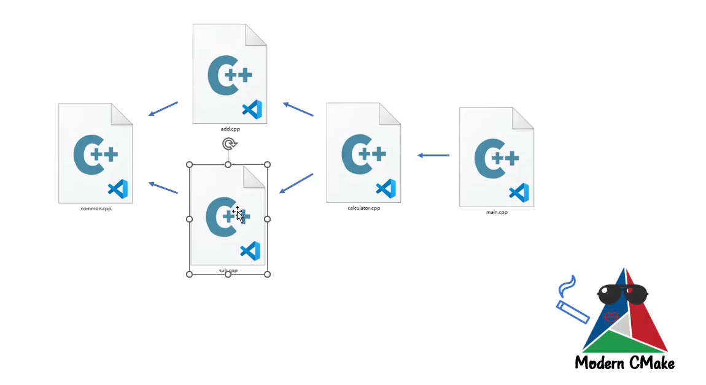

# cmake-learn-note
cmake-learn-note,本repo参考了B站多个视频教程,在此感谢
* [IPADS新人培训第二讲：CMake](https://www.bilibili.com/video/BV14h41187FZ/?spm_id_from=333.337.search-card.all.click&vd_source=bbc0bd6d50c9a37a05c8cb4791842c0f) 及其 [github repo](https://github.com/stdrc/modern-cmake-by-example)
* [CMake教程系列](https://space.bilibili.com/218427631/lists?sid=1849137&spm_id_from=333.788.0.0)

# Lesson 1

假设我有一个形如如下的目录结构，我希望在`main.cpp`中使用`add` 路径下的`add.cpp` 中的函数和包含`add.h` 

```python
.
|-- CMakeLists.txt
|-- add
|   |-- add.cpp
|   `-- add.h
|-- build.sh
`-- main.cpp
```

那根目录下的`CMakeLists.txt` 的写法如下

```cpp
cmake_minimum_required(VERSION 3.16)

project(CMAKE_LEARN) # 项目名

include_directories(add) # 添加add路径，用于Head-Only的路径添加
add_executable(main main.cpp add/add.cpp) # 指定可执行文件所需要的.cpp 文件
```

进一步，如果目录结构调整成如下

```python
.
├── add
│   ├── add.cpp
│   ├── add.h
│   └── CMakeLists.txt
├── CMakeLists.txt
└── src
    ├── CMakeLists.txt
    └── main.cpp
```

那么其实最外围的CMakeLists.txt就是主CMakeLists.txt，可以通过`add_subdirectory(src)` 来让主CMakeLists.txt切换到`src`下的CMakeLists.txt

# Lesson 2

形如如下目录结构，当我们需要将`add` 目录封装成一个库时可以采用两种方式，分别是静态库和动态库

```python
.
|-- CMakeLists.txt
|-- add
|   |-- CMakeLists.txt
|   |-- add.cpp
|   `-- add.h
|-- build.sh
`-- main.cpp
```

- Static Library

对于静态库，`add/CMakeLists.txt` 可以写成如下

```python
add_library(add_static STATIC add.cpp)
```

- Shared Library

对于动态库，`add/CMakeLists.txt` 可以写成如下

```python
add_library(add_shared SHARED add.cpp)
```

## How to use Library

上文是讲如何编译出静态库或者动态库，正如上文中`CMakeLists.txt` 写到`add_library`

所需要的也只是.cpp 文件，所以一般情况下封库的同时也会给使用者一个`.h` 文件用于告知调用者如何调用库中的函数

整体的目录结构如下所示，`lib`目录用于存放add功能的静态库或动态库

```python
.
|-- CMakeLists.txt
|-- build.sh
|-- lib
|   |-- add.h
|   |-- libadd_shared.so
|   `-- libadd_static.a
`-- main.cpp
```

一个简单的使用方式，我们可以这样写`CMakeLists.txt` 

```python

include_directories(./lib) # 用于包含add.h
link_libraries(/root/cmake-learn/lib/libadd_shared.so) # 用于link动态库或者静态库，这里要写绝对路径
add_executable(main main.cpp)

# 当然，modern cmake更推荐采用如下方式进行链接
target_link_libraries(main /root/cmake-learn/lib/libadd_shared.so)
```

# Lesson 3



```python
|-- CMakeLists.txt
|-- add
|   |-- CMakeLists.txt
|   |-- add.cpp
|   `-- add.h
|-- calculator
|   |-- CMakeLists.txt
|   |-- calculator.cpp
|   `-- calculator.h
|-- common
|   |-- CMakeLists.txt
|   |-- common.cpp
|   `-- common.h
|-- dependencies.png
|-- main.cpp
`-- sub
    |-- CMakeLists.txt
    |-- sub.cpp
    `-- sub.h
```

我们有如上图的依赖关系和目录结构，我们希望的是在`main.cpp` 中通过`calculator` 中定义的类来调用`add` 和 `sub`等函数

这是一个很好的例子，来学习如何做project

首先，我们第一步肯定是先从依赖链的最底层组件的`CMakeLists.txt` 开始写起，首先思考：不写行不行？

> common 模块不写的话，其他模块在用的时候该怎么写呢？可以在上一级直接添加源码，或者打包成静态库；采用静态库就需要
> 

```python
/*common路径下CMakeLists.txt*/
add_library(common STATIC common.cpp)
```